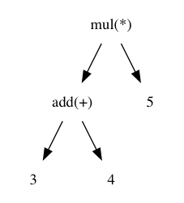

## doteasy

This is a easy script to generate a dot script.
The goal of this tool is to generate different type of picture. like: `ast`，`autoamta`,`finite state machine`, `sequence chart` and so on.

## current situation

Now, it can generate `ast`. And the other types will be added. And the code is mess now, it looks ugly. It will be made up later.

## usage

First, you need install `lex` and `yacc`. If you do so, just use `make` to generate executable binary. The easy script of `ast` looks like:

```shell
#ast:LR

mul:"mul(*)"
add:"add(+)"

add -> 3
add -> 4
mul -> add
mul -> 5
```

Then use the command: `./aste < ast | dot -Tpng -o ast.png` to generate the picture:




More examples see the `example` folder.


## License

(The MIT License)

Copyright (c) 2018 JesseChen <lkchan0719@gmail.com>
